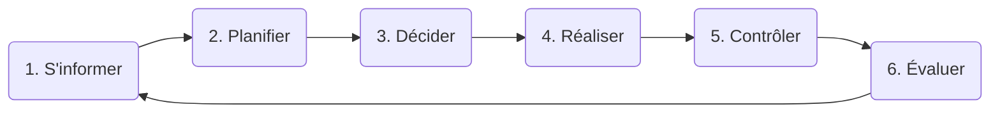

# Méthodologie

Pour planifier mon projet de TPI, je me suis basé sur la méthode en **6 étapes** enseigné au CFPT.

## 1. S'informer

La première étape de mon projet est la lecture et la compréhension de mon énoncé, pour pouvoir y identifier toutes les fonctionnalités a implémenter et si j'ai des doutes je m'informe au près de mon formateur.

## 2. Planifier

Pour la planification de mon projet je définis, pour chaque tâche, leur importance et le temps que je doit leur attribuer. 

Pour se faire je les sépare en 4 groupes de priorités: A:Bloquant > B:Important > C:Secondaire > D:Facultatif.

## 3. Décider

Toutes les décision que je prend qui ont un impact non négligeable sur mon projet son retranscrites et justifiées dans mon journal de bord.

## 4. Réaliser

Après avoir pris mes décision, je continue l'implémentation des fonctionnalités de mon application et la tenue de ma documentation. 

## 5. Contrôler

A chaque fois que je termine une fonctionnalité, je vérifie qu'elle correspond bien aux demande du cahier des charges puis je la teste et vérifie qu'elle fonctionne correctement dans tous les cas de son usage.

# Product backlog

| Nom         | Prendre une carte du paquet                                  |
| ----------- | ------------------------------------------------------------ |
| Description | Je peux prendre une carte dans le paquet et elle s'ajoute a ma main |
| Priorité    | A                                                            |

| Nom         | Choisir le nom du joueur                                     |
| ----------- | ------------------------------------------------------------ |
| Description | Lors du lancement de l'application je peux choisir le nom que j'aurai dans la partie |
| Priorité    | D                                                            |

| Nom         | Création de l'IA pour le croupier                            |
| ----------- | ------------------------------------------------------------ |
| Description | Le croupier serra simulé par une IA et pourra piocher des cartes |
| Priorité    | A                                                            |

| Nom         | Afficher le nombre de carte joué                            |
| ----------- | ----------------------------------------------------------- |
| Description | Un affichage me permettra de suivre le nombre de carte joué |
| Priorité    | B                                                           |

| Nom         | Afficher l'aide du conseiller                                |
| ----------- | ------------------------------------------------------------ |
| Description | Un conseiller m'affichera si oui ou non il est avantageux pour moi de piocher une carte |
| Priorité    | A                                                            |

| Nom         | Affichage des probabilités                                   |
| ----------- | ------------------------------------------------------------ |
| Description | Un affichage me permettra de suivre la probabilité que j'ai d'avoir une certaine valeur en piochant la prochaine carte |
| Priorité    | A                                                            |

| Nom         | Initialisation d'une somme de départ                 |
| ----------- | ---------------------------------------------------- |
| Description | Le joueur commence la partie avec une certaine somme |
| Priorité    | C                                                    |

| Nom         | Affichage tableau des scores                           |
| ----------- | ------------------------------------------------------ |
| Description | A la fin d'une partie un tableau des score est affiché |
| Priorité    | D                                                      |

| Nom         | Afficher de notre porte monnaie                              |
| ----------- | ------------------------------------------------------------ |
| Description | Un affichage nous permet de voir la somme que nous avons actuellement |
| Priorité    | C                                                            |

| Nom         | Les règles de base du Blackjack sont implémenté |
| ----------- | ----------------------------------------------- |
| Description | Nous ne pouvons que tirer une carte et rester   |
| Priorité    | A                                               |

| Nom         | Les règles avancés du Blackjack sont implémenté              |
| ----------- | ------------------------------------------------------------ |
| Description | Nous pouvons doubler la mise, splitter, faire une Assurance et abandonner |
| Priorité    | C                                                            |